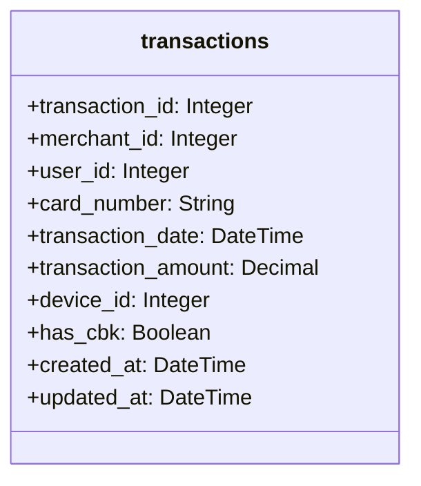

# Anti-Fraud API

Anti Fraud API is a simple Rails API that provides endpoints to manage users and transactions.

The Rails API is configured to use the following:
- Ruby v3
- PostgreSQL
- Rspec
- Factory Bot
- Rubocop
- Bullet
- Bundler Audit

Everything is configured to run with Docker and Docker Compose.

## Setup 🛠️

All you need to do is build the images and run the containers.
```shell
docker compose build
```

Create databases:
```shell
cd backend
docker compose run --rm backend bin/rails db:create
docker compose run --rm backend bin/rails db:migrate
docker compose run --rm backend bin/rails db:migrate RAILS_ENV=test
docker compose run --rm backend bin/rails db:seed
```

Run containers:
```shell
docker compose up
```

## Accessing the app 🌎

The Rails API will be running on `localhost:3000`.

- http://localhost:3000

## Solution

### Class Diagram



### Endpoints

Available endpoints:

- `POST transactions/check` - Checks if a transaction should be approved or denied.
- `GET status/check` - Check if the API is running

### Transactions Anti-fraud Rules

#### Too many requests from the same IP

Not a transaction rule but rather API security.
If the same IP makes more than `X` requests in `Y` minute, it should be blocked.
Currently such limits are set via environment variables.

#### Has CBK

If the transaction has a chargeback, it should not be processed.

#### Night time hours

If the transaction with an amount above `$2,000` is made between 20:00 and 07:00, it should not be processed.
Currently this limit is hardcoded in the `Rules::TransactionAmountAndTimeRule` model.

#### Multiple Transactions
If there are multiple transactions from the same user within a short period of time.

#### Unusual Device
If the `device_id` associated with the transaction is not one that the user typically uses, this could be a sign of fraud.

#### Repeated Card Number
If the same `card_number` is used in rapid succession for multiple transactions, it could be a sign of a stolen card.

#### Has Previous Chargeback
If the user has had a chargeback before, the transaction should be denied.

## FAQ ⁉️

#### Explain the money flow and the information flow in the acquirer market and the role of the main players.
Imagine you have a lemonade stand 💭...

Here's how the money flow and information flow work in the acquirer market with main players:

##### Money Flow
- **Customer 👩‍🦳:** A person buys lemonade from your stand using a credit card.
- **Merchant 🧍‍:** You (the lemonade stand owner) get the money from selling lemonade.
- **Acquirer 🏦:** This is like a big helper bank for your stand. It takes the money from the customer's credit card bank and sends it to you.
- **Issuer 💳:** This is the customer's bank that gave them the credit card. It takes the money from the customer's account and sends it to the acquirer.

##### Information Flow
- **Customer:** Swipes their card at your lemonade stand.
- **Merchant:** Your lemonade stand's card reader sends the information to the acquirer.
- **Acquirer:** Sends the payment request to the customer's bank (issuer).
- **Issuer:** Checks if the customer has enough money and tells the acquirer "yes" or "no."
- **Acquirer:** Sends this answer back to your lemonade stand.
- **Merchant:** If the answer is "yes," you give the lemonade to the customer.

##### Main Players
- **Customer:** Buys the lemonade.
- **Merchant:** Sells the lemonade (that's you).
- **Acquirer:** Helps your stand get the money from the customer's bank.
- **Issuer:** The customer's bank that checks if there's enough money and sends it to the acquirer.

So, the money moves from the customer's bank to you, and information about the payment travels back and forth to make sure it all works smoothly.

#### Explain the difference between acquirer, sub-acquirer and payment gateway and how the flow explained in question 1 changes for these players

##### Acquirer 🏦
- **What it is**: The big helper bank that processes credit card payments for your lemonade stand.
- **Role**: Takes the money from the customer's bank and sends it to you.
- **Flow**: Customer ➡️ Acquirer ➡️ You (Merchant).

##### Sub-Acquirer
- **What it is**: A smaller helper that works with the big helper bank (acquirer).
- **Role**: Helps small businesses like yours connect to the big helper bank.
- **Flow**: Customer ➡️ Sub-Acquirer ➡️ Acquirer ➡️ You (Merchant).

##### Payment Gateway 🌐
- **What it is**: The digital tool that connects your lemonade stand's card reader to the acquirer.
- **Role**: Sends payment information securely over the internet.
- **Flow**: Customer ➡️ Payment Gateway ➡️ Acquirer ➡️ You (Merchant).

### How the Flow Changes

1. **With Sub-Acquirer**:
  - Customer swipes their card.
  - **Payment Information Flow**: Customer ➡️ Payment Gateway ➡️ Sub-Acquirer ➡️ Acquirer ➡️ Issuer ➡️ Acquirer ➡️ Sub-Acquirer ➡️ Payment Gateway ➡️ You.
  - **Money Flow**: Issuer ➡️ Acquirer ➡️ Sub-Acquirer ➡️ You.

2. **With Payment Gateway**:
  - Customer swipes their card.
  - **Payment Information Flow**: Customer ➡️ Payment Gateway ➡️ Acquirer ➡️ Issuer ➡️ Acquirer ➡️ Payment Gateway ➡️ You.
  - **Money Flow**: Issuer ➡️ Acquirer ➡️ You.

So, adding a sub-acquirer or a payment gateway just adds more helpers to make sure the money and information get where they need to go!


#### Explain what chargebacks are, how they differ from cancellations and what is their connection with fraud in the acquiring world.

1. **Chargebacks**: Customer asks the bank for a refund after buying.
2. **Cancellations**: Customer changes their mind before buying.
3. **Fraud**: Someone uses a stolen card, leading to chargebacks when the real owner disputes the charge.

##### How They Differ
- **Chargebacks**: Happen after the sale is completed. The customer gets their money back through the bank.
- **Cancellations**: Happen before the sale is completed. The customer changes their mind, and you stop the sale.
- **Fraud**: Happens when someone uses a stolen card. The real owner disputes the charge, leading to a chargeback.

## Conclusions 📝

The anti-fraud API developed here is a simple solution to prevent fraud transactions.
It has a few rules to check if a transaction should be approved or denied and
it can be easily extended to add more rules and improve the fraud detection system.
Such as:

- Implement geo location rule, where if it's a transaction outside of the common used region, we could deny it.
- Implement and integrate a score system, where each rule has a score and if the total score is above a certain threshold,
  the transaction is denied.
- Maybe implement a machine learning model to predict fraud transactions.
- Add API token authentication to avoid unauthorized access
- Integrate with external services to check if the card is stolen or if the user has a history of fraud
- Have more details about the user and the merchant to make better decisions
  - It could be that are both fraudsters, or maybe the merchant is the fraudster and the user is a victim
- Improve the user profiling to detect unusual behavior