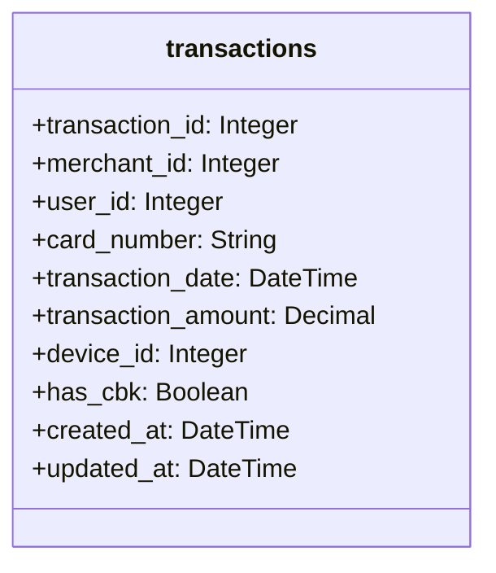

# Anti-Fraud API

Anti Fraud API is a simple Rails API that provides endpoints to manage users and transactions.

The Rails API is configured to use the following:
- Ruby v3
- PostgreSQL
- Rspec
- Factory Bot
- Rubocop
- Bullet
- Bundler Audit

Everything is configured to run with Docker and Docker Compose.

## Setup 🛠️

All you need to do is build the images and run the containers.
```shell
docker compose build
```

Create databases:
```shell
cd backend
docker compose run --rm backend bin/rails db:create
docker compose run --rm backend bin/rails db:migrate
docker compose run --rm backend bin/rails db:migrate RAILS_ENV=test
docker compose run --rm backend bin/rails db:seed
```

Run containers:
```shell
docker compose up
```

## Accessing the app 🌎

The Rails API will be running on `localhost:3000`.

- http://localhost:3000

## FAQ ⁉️

### Explain the money flow and the information flow in the acquirer market and the role of the main players.
_TBA_

### Explain the difference between acquirer, sub-acquirer and payment gateway and how the flow explained in question 1 changes for these players.
_TBA_

### Explain what chargebacks are, how they differ from cancellations and what is their connection with fraud in the acquiring world.
_TBA_

## Solution

## Class Diagram

