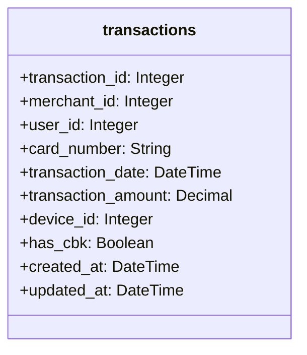

# Anti-Fraud API

Anti Fraud API is a simple Rails API that provides endpoints to manage users and transactions.

The Rails API is configured to use the following:
- Ruby v3
- PostgreSQL
- Rspec
- Factory Bot
- Rubocop
- Bullet
- Bundler Audit

Everything is configured to run with Docker and Docker Compose.

## Setup 🛠️

All you need to do is build the images and run the containers.
```shell
docker compose build
```

Create databases:
```shell
cd backend
docker compose run --rm backend bin/rails db:create
docker compose run --rm backend bin/rails db:migrate
docker compose run --rm backend bin/rails db:migrate RAILS_ENV=test
docker compose run --rm backend bin/rails db:seed
```

Run containers:
```shell
docker compose up
```

## Accessing the app 🌎

The Rails API will be running on `localhost:3000`.

- http://localhost:3000

## FAQ ⁉️

### Explain the money flow and the information flow in the acquirer market and the role of the main players.
_TBA_

### Explain the difference between acquirer, sub-acquirer and payment gateway and how the flow explained in question 1 changes for these players.
_TBA_

### Explain what chargebacks are, how they differ from cancellations and what is their connection with fraud in the acquiring world.
_TBA_

## Solution

### Class Diagram



### Endpoints

Available endpoints:

- `POST transactions/check` - Checks if a transaction should be approved or denied.
- `GET status/check` - Check if the API is running

### Transactions Anti-fraud Rules

#### Too many requests from the same IP

Not a transaction rule but rather API security.
If the same IP makes more than `X` requests in `Y` minute, it should be blocked.
Currently such limits are set via environment variables.

#### Has CBK

If the transaction has a chargeback, it should not be processed.

#### Night time hours

If the transaction with an amount above `$2,000` is made between 20:00 and 07:00, it should not be processed.
Currently this limit is hardcoded in the `Rules::TransactionAmountAndTimeRule` model.

#### Multiple Transactions
If there are multiple transactions from the same user within a short period of time.

#### Unusual Device
If the `device_id` associated with the transaction is not one that the user typically uses, this could be a sign of fraud.

#### Repeated Card Number
If the same `card_number` is used in rapid succession for multiple transactions, it could be a sign of a stolen card.

#### Has Previous Chargeback
If the user has had a chargeback before, the transaction should be denied.

### Future Improvements

- Implement geo location rule, where if it's a transaction outside of the common used region, we could deny it.
- Implement and integrate a score system, where each rule has a score and if the total score is above a certain threshold,
the transaction is denied.
- Maybe implement a machine learning model to predict fraud transactions.
- Add API token authentication to avoid unauthorized access.